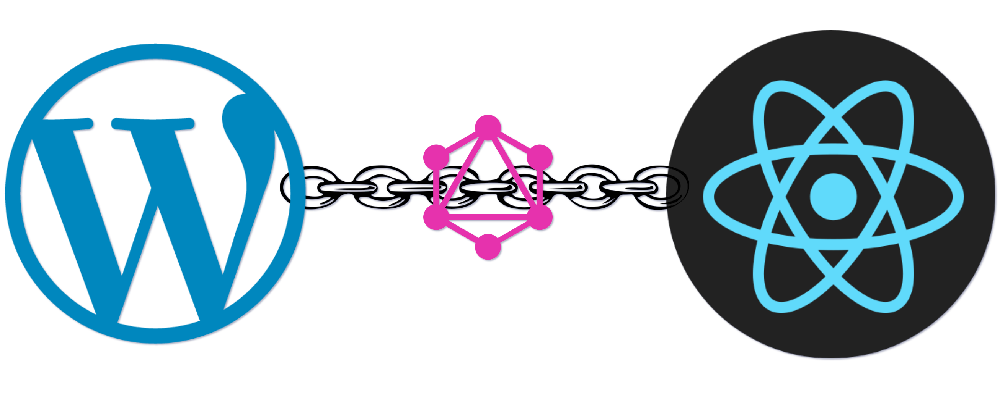

# WP Decoupled Base

There are certain mistakes which I made in this project. So, here are the list of those [mistakes](#mistakes).

A WordPress decoupled setup. This is similary to [Souptik2001/Souptik2001.github.io](https://github.com/Souptik2001/Souptik2001.github.io) just with GraphQL layer separate from WordPress and React instead of Next.JS. The total setup is divided into three parts -
- **WordPress** - Just a CMS to store the data and exposes the data to be consumed by its REST API.
- **GraphQL Server** - GraphQL runs as a separate service, which is used by the frontend React application to consume data. GraphQL uses the WordPress as one of its data source (in this case the one and only data source) to consume data and serve that to frontend application.
- **Frontend React Application** - The React application consumes the data from the the GraphQL server and displays that to the user.

### Local setup

**For faster setup using Docker please check [here](#docker-based-setup-).**

- Clone the repository.
- WordPress setup -
	- Create a local WordPress setup.
	- Copy the backend directory's content to `wp-content` folder.
	- Optional - Activate the `wp-rest-api-v2-menus` plugin - `wp plugin activate wp-rest-api-v2-menus`  (if you want to see the nav-menus).
	  - The `primary menu` will be displayed on the nav-menu. So, you have to create a menu and assign that to `primary menu`.
	- Activate the `wordpress-importer` plugin - `wp plugin activate wordpress-importer`.
	- The custom post type I have registered in a mu-plugin, `test.php` (did this because this was a dummy project, ideally should have created a plugin). Couldn't flush rewrite rule because of using mu-plugin. But rewrite rules will not be required in this case. And in the next steps we will be changing the rewrite rule, so it will be automatically flushed.
	  - When we create a plugin instead of mu-plugin, then if the plugin is deactivated then the site would break. In that case on VIP environment we can activate those plugins through code, to make sure they are always active.
	- Import the sample data provided using - `wp import <file> --authors=create`.
	- Change the permalink structure to some pretty permalink structure - `wp rewrite structure '/%year%/%monthnum%/%day%/%postname%/'`
	- Create application password of a user - `wp user application-password create <user> "GraphQL server"`. This will be used in the GraphQL section to fill the environment variables.
- GraphQL setup -
	- Go to the `graphql` directory of the project.
	- Run `nvm use`.
	- Run `npm install`.
	- Create a `.env` file from `sample.env` file. And fill up the required values.
	- Run `npm run start` or `npm run dev`(runs `nodemon`).
- React setup -
	- Go to `test-app` directory.
	- Run `nvm use`.
	- Run `npm install`.
	- Create a `.env` file from `sample.env` file. And fill up the required values.
	- Run `npm run serve` (To create production-ready build).
	- Please note that if you run development build, using `npm run start` there will be one issue -
	  - You will see that the post views in post single page is increasing by 2 instead of 1. This is because of React Strict mode's twice running `useEffect()` hook on development build.

#### Docker based setup 🐳

For running the docker based setup just run `docker compose up`. The apps will be exposed in the following ports of your system.
- The WordPress instance will be accessible through port `8080`.
- The GraphQL instance will be accessible through port `4040`.
- And the React instance will be accessible through port `3030`.

One thing to note is that when you will run the `docker compose up` command then, you will notice that the WordPress container throws errors and fails for sometime. That's because the `depend_on` parameter ensures that the database container is started, but doesn't ensure that the DB is ready to accept connections. For that reason initially it fails. But it keeps retying due to the `restart` configuration, and ultimately, when the DB is ready, the WordPress also get's installed successfully.
Also here, the codebase is not mapped to the docker container volumes. Therefore any changes will not be reflected inside the containers.

### TODO

- Unit Testing. Have to write the following unit tests -
  - [ ] Surely something..

### Mistakes

- Didn't use proper naming conventions for fields of GraphQL types. The fields should be of `camelCase`, but I have used `snake_case`.
- The React code is not created keeping testability in mind. That's why writing test cases for these has become be difficult.
- The schema is not query driven. I have created the query as per the data returned by the WordPress REST API. But this is not recommended. The schema should be always as per the client's requirement.
